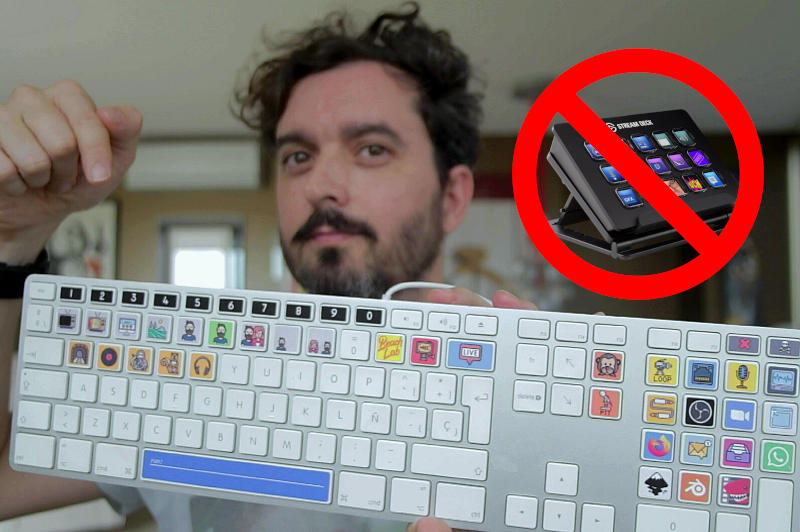

# stream-deck

A free and open source alternative to [elgato streamdeck](https://www.elgato.com/en/gaming/stream-deck) using an old keyboard, python and Linux.



> **Disclaimer 1:** This is not a universal solution. I am just sharing my set-up, designs and scripts. You still will need knowledge in the mentioned topics to adapt it to your needs.  
**Disclaimer 2:** This is unfinished/ongoing work


## What you need

- Linux (Apple victims and Windows ~~loosers~~ users see below). I use Arch.
- Python 3 and a bunch of python libs (check the import section of the script)
- An old keyboard, I am using an Apple one but any one will do.

To print and cut the stickers you also need these: (warning, sponsored links. Amazon will give me money if you buy from here):

- An inkjet printer. I use [this one](https://amzn.to/2yzq1Sc)
- Inkjet printable vinyl. I use [this one](https://amzn.to/2LVL04P)
- A vinyl cutter. I use [this one](https://amzn.to/2Xr1k2K)

## Sticker designs

I downloaded most of the icons from https://www.flaticon.com credit goes to each one of the authors :heart: I created an svg template to place the icons (still WIP).


## The script

The [script](autohotkey.py) is a python program that *grabs* the keyboard an then launches programs, emulate keystokes and soon will also send MIDI messages. Modify your keyboard `by-id` value.

## Hotplug 

To execute the script when I plug the keyboard I created a udev rule `/etc/udev/rules.d/99-apple-keyboard.rules` with this content:

```bash
SUBSYSTEM=="input", SUBSYSTEMS=="usb", ACTION=="add", ATTRS{idVendor}=="05ac", ATTRS{idProduct}=="0221", ENV{DISPLAY}=":0", ENV{XAUTHORITY}="/home/unix/.Xauthority", RUN+="~/autohotkey.py"
````

You need to modify your `ATTRS{idVendor}` and  `ATTRS{idProduct}`. Use `lsusb` to fin out yours. And finally reload the rules `sudo udevadm control --reload-rules`. The script should now run every time you plug the keyboard.

> Note: Hotplug does not work if I use notify2. However it works if I start it manually. I wonder why...

## Mac and Windows users

- Mac users could achieve the same using [Karabiner elements](https://karabiner-elements.pqrs.org/)
- Windows users also with [AutoHotkey](https://www.autohotkey.com/)
